# Geoprocessing Service Notes
This document contains notes and instructions for publishing and using a Geoprocessing Service.
These notes come from experimentation with a sample GP Tool (MeanCenter) but could be applied to a GAIT
GP Tool in the future.

## Table of Contents
- [Publishing a Geoprocessing Service (Web Tool)](#publishing-a-geoprocessing-service-web-tool)
- [Using a Geoprocessing Service via REST API](#using-a-geoprocessing-service-via-rest-api)
  - [Generating a Token](#generating-a-token)
  - [Simple Call](#simple-call)
  - [Executing](#executing)
  - [Submitting a Job](#submitting-a-job)
- [Using a Geoprocessing Service via ArcPy](#using-a-geoprocessing-service-via-arcpy)
  - [Importing as a Toolbox](#importing-as-a-toolbox)
  - [Using the Toolbox](#using-the-toolbox)
- [TODO Items](#todo-items)

## Publishing a Geoprocessing Service (Web Tool)

Upon Google searching how to do this, the first guide that comes up is typically this one: 
https://pro.arcgis.com/en/pro-app/latest/help/analysis/geoprocessing/share-analysis/quick-tour-of-authoring-and-sharing-geoprocessing-services.htm

Following this guide up until the "Configure ArcGIS server connection type"  section is straightforward.
However, in this section, the guide states that the connection type to your ArcGIS Server should be modified to "Administrator" 
and not "User". When attempting to modify this value, the box is greyed out and cannot be changed. [Several arcgis forum
posts](https://community.esri.com/t5/arcgis-pro-questions/cannot-change-arcgis-server-connection-type-in/td-p/433900) 
describe this same issue without a clear resolution.

After talking to folks in PS more familiar with publishing GP Services, a different way of 
publishing was suggested that is easier and more commonly used. This way involves publishing a web tool
instead of a geoprocessing service. The steps are as follows:

1. Open ArcGIS Pro and log into your portal:

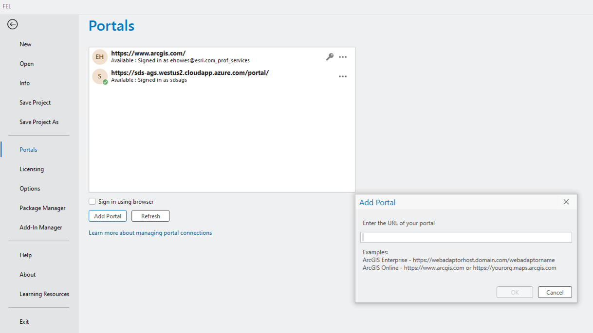

2. Run the GP Tool locally that needs to be published:

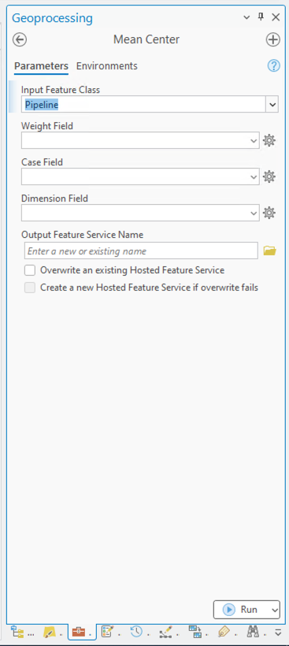

3. Navigate to the Geoprocessing History
4. Right click on the GP Tool run and select **"Share as"** then **"Share Web Tool"**

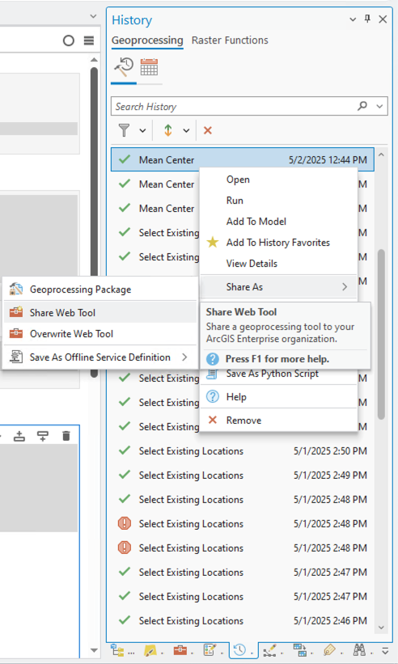

5. Leave most values as default except two important ones:
   - Under **"Configuration"** set the drop-down menu for **Message Level** to **"Warning"**
       - This will allow the tool to display warning messages in addition to errors, which is helpful for debugging.

        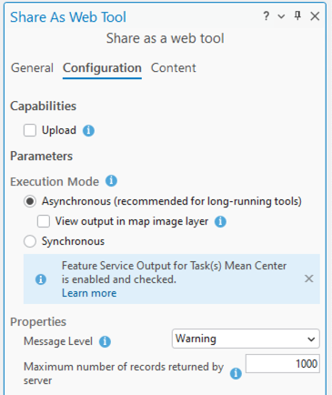

   - Under **"General"**, **"Data"**, optionally select **Copy all data**. 
     - This will upload the layers currently in the TOC alongside the GP Service. That way, if
       the tool requires a feature layer as input, only the layer name needs to be provided. 
     - The GP Service can always take links to feature services as well, but this is a bit more
       convenient for testing.

        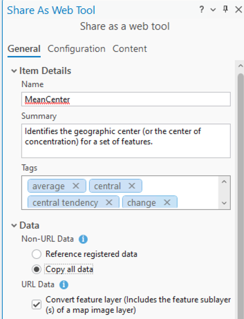

6. Select **Analyze** to check for any errors or warnings. Then select **Publish** to publish the service.

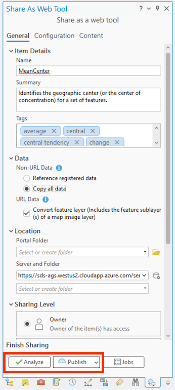

7. Navigating to the portal, a new tool item should appear:

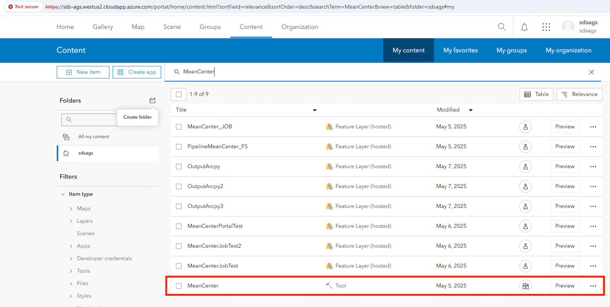

8. Clicking on the tool item will open a new page that describes this tool as a Geoprocessing Service.
   - The URL for the service can be found in the **URL** section. This is a useful link to visit to
   view the parameters of the service. This URL will also be needed later to call the service.

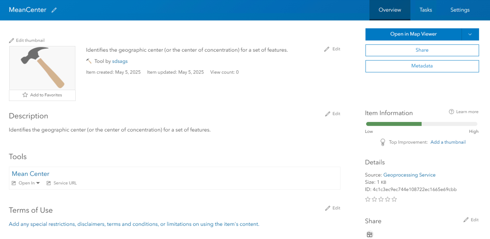
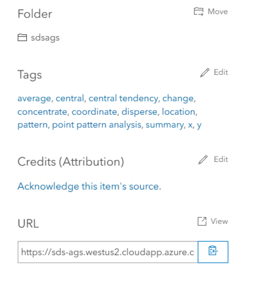

**Note about "Web Tool" vs "Geoprocessing Service":** The difference between these two are not clear in the documentation. 
When looking at the web tool in the portal after publishing using the steps above, the portal refers
to it as a Geoprocessing Service. In general, a web tool is like an extra layer of abstraction over 
a GP service. A web tool uses a GP service, can have multiple GP services, and can be more easily
integrated into a web app with its own interface. Meanwhile, the GP service is JUST a REST endpoint.
Deploying a web tool is much easier than deploying a GP service, and doing so will also deploy a GP service.

## Using a Geoprocessing Service via REST API

### Generating a Token

For all calls to the GP Service API, a token is required. The token can be generated using the following GET request 
in [HTTPie](https://httpie.io/) or [Postman](https://www.postman.com/downloads/):

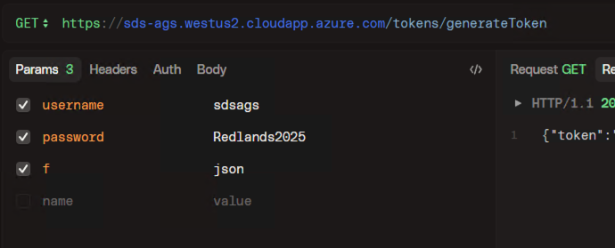

Use the `f` parameter to set the output format to `json`. By default, HTML is returned which did
not display properly in HTTPie.

#### First Time token Generation:

If this is the first time a token is being generated using this ArcGIS server, token acquisition via
GET must be enabled. To do this, the ArcGIS Server Administrator Directory must be accessed. 
Follow [this guide](https://enterprise.arcgis.com/en/server/latest/administer/windows/enable-token-acquisition-through-an-http-get-request.htm)
to enable token acquisition via GET.

Note: The URL formatting suggested in the guides was not correct for the simple test enterprise server 
set up for the SDS team. The administrator directory URL is as follows:
```
https://sds-ags.westus2.cloudapp.azure.com/server/admin
```
The guide suggests the ending of this url should be `/arcgis/admin`, but this is not the case for the SDS test server.
Further investigation into this could be valuable.

### Simple Call

Make a GET request to the GP Server to get basic information about the service. 
This is a good way to test that the service is up and running. Note, the URL used for this request
is the same URL provided when viewing this tool in the portal:

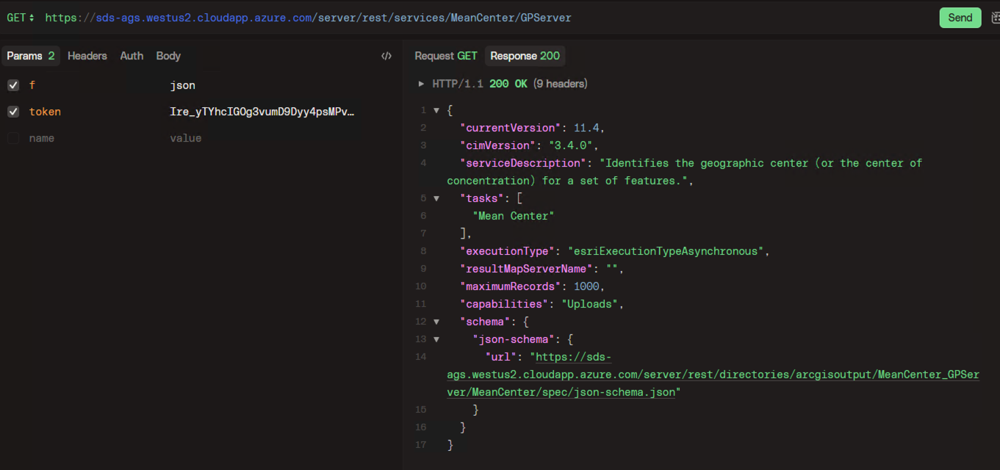

Again, use the `f` parameter to set the output format to `json`. By default, HTML is returned which did
not display properly in HTTPie.

### Executing

It is possible to execute this GP Service using a GET request with a URL formatted like this:
```
https://sds-ags.westus2.cloudapp.azure.com/server/rest/services/MeanCenter/GPServer/Mean Center/execute 
```
However, an "Error performing execute operation" message was returned in testing. This is 
likely due to parameters in the request being incorrectly formatted, but the message does not
indicate which parameter is causing the issue, making it difficult to debug.

The benefit of using **execute** is that the request is synchronous. The program will wait
for the results to returned. This could be revisited in the future.

It was easier to submit a job to the GP Service, see the next section for details.

### Submitting a Job

Make a GET request to the GP Server using the `submitJob` endpoint with the parameters the 
GP Service requires:

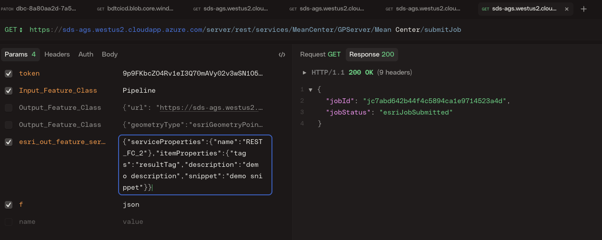

The `esri_out_feature_service_name` is important as it defines the name of the output feature service.
This request will return a `jobID` that will begin to execute asynchronously on the server.
To check the status of the job, make the following GET request:

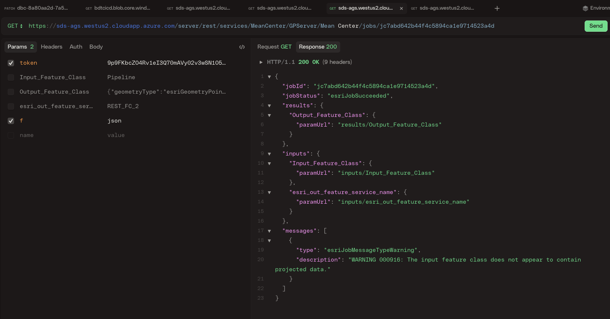

Submitting a job manually via the REST API this way will indicate a successful completion of the
job. However, the output feature service will not be created. But, when submitting a job via
ArcGIS Pro, ArcPy, or the `submit job` UI [here](https://sds-ags.westus2.cloudapp.azure.com/server/rest/services/MeanCenter/GPServer/Mean%20Center/submitJob),
the output feature service will be created and appear in the portal. It was unclear as to why 
this is the case, but this was not explored further as the ArcGIS API for JavaScript or ArcPy 
will likely be used to call the GP Service for GAIT anyway, which will handle this request for us 
and create an output feature service if needed.

Documentation useful for job submission can be found here:
- https://pro.arcgis.com/en/pro-app/latest/help/analysis/geoprocessing/share-analysis/using-web-tools-in-python-scripts.htm
- https://enterprise.arcgis.com/en/server/10.3/publish-services/windows/task-parameter-properties.htm
- https://developers.arcgis.com/rest/services-reference/enterprise/submit-gp-job/#example-1-request-an-output-feature-service-as-the-result-using-a-string

## Using a Geoprocessing Service via ArcPy

### Importing as a Toolbox

To use a Geoprocessing Service in ArcPy, it must be imported as a toolbox.
There are several ways documented to do this:
- https://pro.arcgis.com/en/pro-app/latest/arcpy/functions/importtoolbox.htm
- https://pro.arcgis.com/en/pro-app/latest/help/analysis/geoprocessing/share-analysis/using-geoprocessing-services-in-python-scripts.htm

#### The following code snippets demonstrate different import methods using the sample GP Service in the SDS test server:

The easiest way is to make sure Pro is logged into the portal where the GP Service is, and run
the following in a Pro notebook. This method does not require a password or token to be passed:
```python
import arcpy
tbx = "https://sds-ags.westus2.cloudapp.azure.com/server/services;MeanCenter;UseSSOIdentityIfPortalOwned"
arcpy.ImportToolbox(tbx)
```

This does not require a Portal login in Pro, but does require the portal login credentials to 
be passed to the import:
```python
import arcpy
tbx_url = "https://sds-ags.westus2.cloudapp.azure.com/server/services;MeanCenter;sdsags;Redlands2025"
arcpy.ImportToolbox(tbx_url)
```

No login credentials required at all, but requires a token to be passed:
```python
import arcpy

token = '<insert-token-here>'
referrer = 'https://sds-ags.westus2.cloudapp.azure.com/'
tbx = 'https://sds-ags.westus2.cloudapp.azure.com/server/services;' + \
      'MeanCenter;token={};{}'.format(token, referrer)
arcpy.ImportToolbox(tbx)
```

### Using the Toolbox

Once the toolbox is imported, it can be used in ArcPy like any other toolbox. However, some
GP Services (like the sample one that was used for testing) are asynchronous and require
additional code around the tool call to check for completion.

```python
# creates "OutputArcpy" hosted feature service in Pro and in the portal.
result = arcpy.MeanCenter_MeanCenter(
    Input_Feature_Class="Pipeline",
    Weight_Field=None,
    Case_Field=None,
    Dimension_Field=None,
    esri_out_feature_service_name="OutputArcpy"
)

while result.status < 4:
	   print(result.status)
	   time.sleep(0.2)
print("Execution Finished")

print(result.getMessages())
```

This will create a feature service that is viewable in the portal, unlike calling the GP Service 
directly through the REST API.

See the [ArcGIS Pro documentation](https://pro.arcgis.com/en/pro-app/latest/help/analysis/geoprocessing/share-analysis/using-geoprocessing-services-in-python-scripts.htm)
for more details on using a GP Service in ArcPy.

## TODO Items:
- Call the GP Service using the ArcGIS API for JavaScript (asynchronously and 
  synchronously)
- Diagram the workflow of the GAIT GP Service (including FastAPI, etc.)